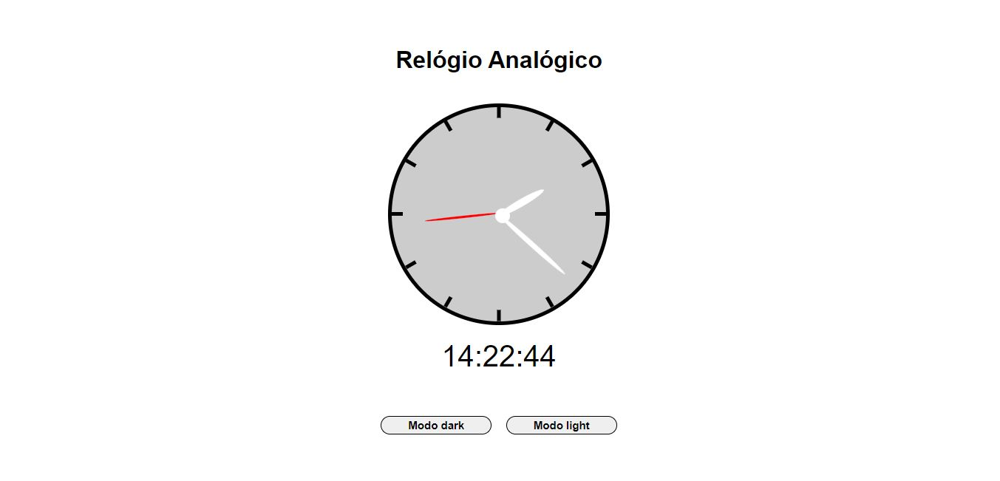

# Relogio Analogico

> Projeto finalizado!
 

## 💻 Sobre o Projeto

Este projeto trata-se de um relogio analogico com responsividade e animações no modo dark,  teste o modo dark, espero que tenha curta 😉

 

## 👨‍💻Link para acesso: 
<a href="https://lourenco-biel.github.io/Relogio/">Aperte aqui ⬅ </a>

## ☕ tecnologias utilizadas

 

## 🤝 Colaborador

<table>
  <tr>
    <td align="center">
      <a href="#">
         
        
          <a >Gabriel Ibiapino</a>
        
      </a>
    </td>
  </tr>
</table>

  

 

[⬆ Voltar ao topo](#Relogio-Analogico) 